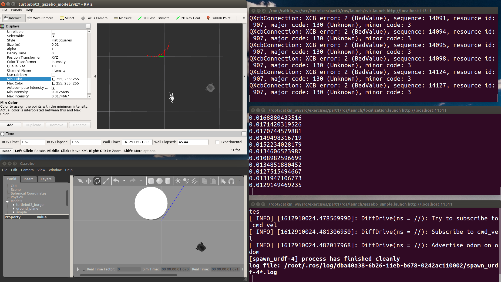
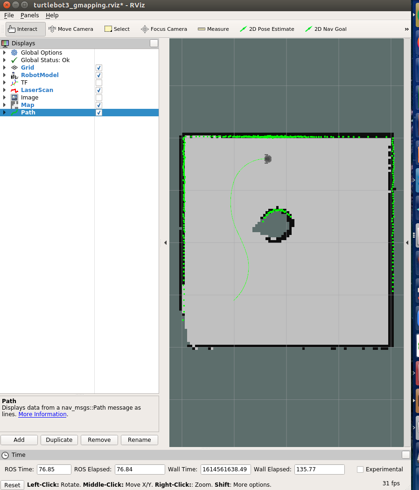

This repo contained assignments for the [Cambridge Mobile Robotic Course](https://www.youtube.com/playlist?list=PLaTKfS3-bDpDyOwrxLcQRGxY9XJw33ANo).

### Practical 1 
This practical showcase the following concepts:
- Robot motion and control
- Control architectures
- Sensing
- Localization

In this practical, we have experiments Euler methods and RK4 algo for robot pose estimation. And tried out reactive path planning with Braitenberg Controller verse Rule-based Controller. Finally, we also implemented Monte Carlo method and Extended Kalman filter for the Localization problem and kinnap robot problem. We simulated the environment for turtlebot with Gazebo and visualized with RViz as shown below:

### Practical 2
This practical showcase the following concepts:
- Navigation

In this practical, we experimented with various motion planners
- Potential Field Methods
- Rapidly exploring Random Tree (RRT)
- RRT*

Combined with a given slam library and the implemented RRT algorithm, we achieve SLAM and motion planning simutantously, as shown below:

